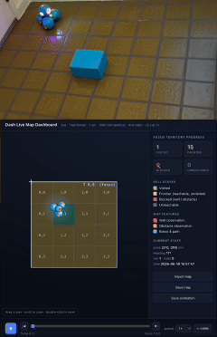
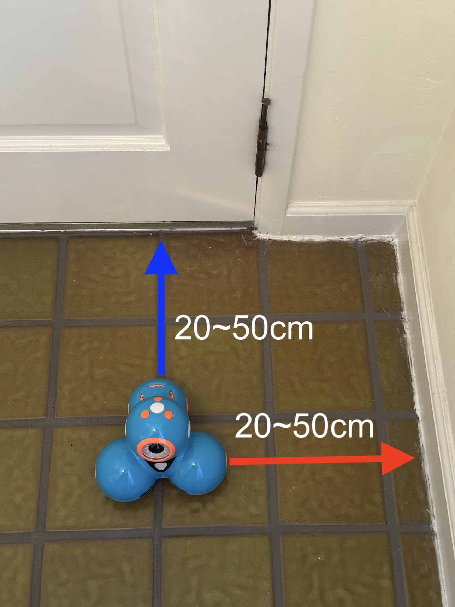

# pydashbot

## What is it?

`pydashbot` is Python control software for the Wonder Workshop Dash robot via BLE (Bluetooth Low Energy)

It provides:

- A persistent WebSocket server that keeps one Bluetooth connection open
- A command-line client for sending robot commands
- A live room-mapping dashboard
- Direct synchronous and asynchronous Python APIs
- Obstacle-aware, bounded movement
- Access to Dash's sensors, lights, head, wheels, and sounds
- Hardware examples, calibration tools, and automated tests

The project focuses exclusively on **Dash**. It does not aim to provide a
general API for Dot, Cue, or other Wonder Workshop robots.

## Demo Application (map + dashboard)



The demo application explores a room with Dash, builds a 2D map, and streams
the robot's pose to a browser dashboard. The dashboard can also export the map
JSON and a standalone HTML animation replay.

At a high level:

1. The WebSocket server connects to Dash over Bluetooth.
2. The map app sends movement and sensor commands through that server.
3. The dashboard runs in a browser and receives live map updates over HTTP.

## Requirements

- Python 3.11
- [uv](https://docs.astral.sh/uv/)
- A Bluetooth Low Energy adapter
- A Wonder Workshop Dash robot

`pydashbot` is tested on macOS and Ubuntu.

On macOS, allow your terminal application to use Bluetooth in **System
Settings > Privacy & Security > Bluetooth**.

## Quick Start

Install the project:

```bash
git clone https://github.com/daigotanaka/pydashbot.git
cd pydashbot
uv sync
```

Turn on Dash before connecting. Only one process can maintain the Bluetooth
connection at a time.

Start the WebSocket server in one terminal:

```bash
uv run dash.remote.server
```

Place Dash in open space, then calibrate it from a second terminal:

```bash
mkdir -p data/calibration
uv run apps/map/calibrate.py --output data/calibration/calibration.json
```

Create `data/config.yaml`:

```yaml
map_file: data/room_map.json
calibration: data/calibration/calibration.json
duration_seconds: 60
territory_size_mm: 1000

policies:
  exploration: conservative
  navigation: d-star-lite

docking:
  init: true

dashboard:
  active: true
  host: 127.0.0.1
  port: 8000
```

Place Dash near a room corner with its back roughly facing one wall and its
left side roughly facing the adjacent wall:



Start the dashboard and map app:

```bash
uv run apps.dashboard --config data/config.yaml
```

Open [http://127.0.0.1:8000](http://127.0.0.1:8000) to watch the live map.

To resume an existing map instead of starting from the dock pose:

```bash
uv run apps.dashboard --config data/config.yaml --map-mode resume
```

To send Dash home using the saved map, run the map app directly:

```bash
uv run apps.map dock --config data/config.yaml
```

## Safety

Dash is a physical robot. Always test movement on the floor in a clear area,
keep it away from stairs, and be ready to stop it.

Obstacle and tilt detection are best-effort safeguards. Proximity sensors
cannot reliably detect every material, shape, or approach angle.

The WebSocket server has no authentication. Binding it to `0.0.0.0` or a LAN
address allows other devices on that network to control the robot. Only expose
it on a trusted network.

## Programming your Dash with Python

Want to develop your application with Python? See [dash/README.md](dash/README.md).

## Credits

Early protocol knowledge used by this project came from:

- [Bleak](https://github.com/hbldh/bleak) for BLE control
- [chubbykat's bleak-dash](https://github.com/mewmix/bleak-dash)
- [Ilya Sukhanov's morseapi](https://github.com/IlyaSukhanov/morseapi)
- [Russ Buchanan's python-dash-robot](https://github.com/havnfun/python-dash-robot)

Those projects made independent control of Wonder Workshop robots possible and
deserve credit for documenting much of the low-level behavior.

`pydashbot` has since become an independently structured and reimplemented
project. It is centered on Dash, uses Bleak for Bluetooth Low Energy, and adds
layered motion safety, persistent communication servers, WebSocket control,
tests, and hardware tools.

## License

[Apache 2.0 License](LICENSE)
